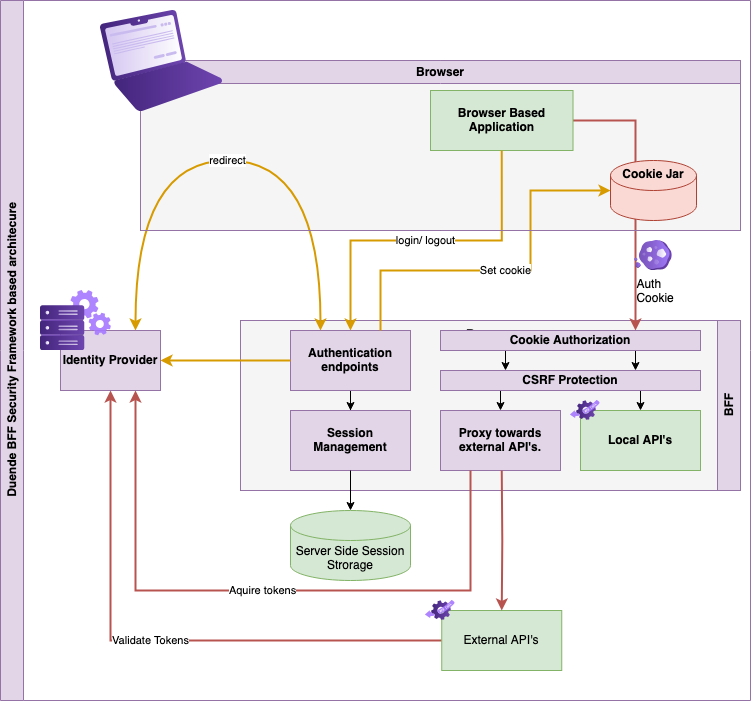

# Frontend For Backend

[bff](https://docs.duendesoftware.com/bff/)
## The Duende BFF framework

Duende.BFF is a library for building services that comply with the BFF pattern and solve security and identity problems in browser based applications such as SPAs and Blazor based applications. It is used to create a backend host that is paired with a frontend application. This backend is called the Backend For Frontend (BFF) host, and is responsible for all the OAuth and OIDC protocol interactions. It completely implements the latest recommendations from the IETF regarding security for browser based applications.

It offers the following functionality:

- Protection from Token Extraction attacks
- Built-in CSRF Attack protection
- Server Side OAuth 2.0 Support
- Multi-frontend support (Introduced in V4)
- User Management APIs
- Back-channel logout
- Securing access to both local and external APIs by serving as a reverse proxy.
- Server side Session State Management
- Blazor Authentication State Management
- Open Telemetry support (Introduced in V4)


## The BFF Framework in an application architecture



When the user wants to log in, the app can redirect the browser to the authentication endpoints. This will trigger an OpenID Connect authentication flow, at the end of which, it will place an authentication cookie in the browser. This cookie has to be an HTTP Only Same Site and Secure cookie. This makes sure that the browser application cannot get the contents of the cookie, which makes stealing the session much more difficult.


The browser will now automatically add the authentication cookie to all calls to the BFF, so all calls to the APIs are secured. This means that local api’s are already automatically secured.

The app cannot access external Api’s directly, because the authentication cookie won’t be sent to 3rd party applications. To overcome this, the BFF can proxy requests through the BFF host, while exchanging the authentication cookie for a bearer token that’s issued from the identity provider. This can be configured to include or exclude the user’s credentials.


```sh
As mentioned earlier, the BFF needs protection against CSRF attacks, because of the nature of using authentication cookies. While .net has various built-in methods for protecting against CSRF attacks, they often require a bit of work to implement. The easiest way to protect (just as effective as the .Net provided security mechanisms) is just to require the use of a custom header. The BFF Security framework by default requires the app to add a custom header called x-csrf=1 to the application. Just the fact that this header must be present is enough to protect the BFF from CSRF attacks.
```


Server-side sessions are instances that are persisted to data storage and allow for visibility into currently active sessions and better management techniques. Let’s take a look at the advantages of server-side sessions. Server-side sessions at each component allows for:

- Receiving back channel logout notifications
- Forcibly end a user’s session of that node
- Store and view information about a session lifetime
- Coordinate sessions across an application’s components
    Different claims data

Server-side sessions at IdentityServer allow for more powerful features:

- Receive back channel logout notifications from upstream identity providers in a federation
- Forcibly end a user’s session at IdentityServer
- Global inactivity timeout across SSO apps and session coordination
- Coordinate sessions to registered clients

### Site
Browsers sometimes need to distinguish precisely between different sites. For example, the browser must only send SameSite cookies to the same site that set them.

For this more precise definition a site is determined by the registrable domain portion of the domain name. The registrable domain consists of an entry in the Public Suffix List plus the portion of the domain name just before it. This means that, for example, `theguardian.co.uk`, `sussex.ac.uk`, and `bookshop.org` are all registrable domains.

According to this definition, `support.mozilla.org` and `developer.mozilla.org` are part of the same site, because `mozilla.org` is a registrable domain.
The site refers to the registrable domain used for same-site cookie policies and origin isolation.
- Site: example.co.uk
In the public suffix list model (used by browsers):
- `co.uk` is a public suffix
- `example.co.uk` is the registrable domain

This means two different subdomains like `a.example.co.uk` and `b.example.co.uk` are considered the `same site`, even though they’re `different origins`.


The origin consists of the `scheme (protocol)`, `host (domain)`, and `optional port (if non-default)`:
- Origin: https://example.co.uk


## CSP
This document defines Content Security Policy (CSP), a tool which developers can use to lock down their applications in various ways, mitigating the risk of content injection vulnerabilities such as cross-site scripting, and reducing the privilege with which their applications execute

`Content-Security-Policy: default-src 'self'; script-src 'self' https://apis.example.com;`

This means:
- Load everything (`default-src`) only from the same origin
- Load JavaScript only from the same origin and https://apis.example.com


MegaCorp Inc’s developers want to protect themselves against cross-site scripting attacks. They can mitigate the risk of script injection by ensuring that their trusted CDN is the only origin from which script can load and execute. Moreover, they wish to ensure that no plugins can execute in their pages' contexts. The following policy has that effect:

`Content-Security-Policy: script-src https://cdn.example.com/scripts/; object-src 'none'`


## CSRF
CSRF attacks exploit the fact that browsers automatically send authentication cookies with requests to the same site. Should an attacker trick a user that’s logged in to an application into visiting a malicious website, that browser can make malicious requests to the application under the credentials of the user.


CSRF occurs when:
- A user is authenticated on a trusted website (e.g., bank.com)
- The browser automatically sends cookies (like session or auth tokens) with every request to bank.com
- An attacker’s malicious site (e.g., evil.com) silently causes the user’s browser to send a request to bank.com — using the user’s credentials
- The request is accepted because it appears legitimate


`Because browsers automatically attach cookies for matching domains — regardless of where the request originates from — unless protections like SameSite are used.`

## How to Prevent CSRF

1. Use SameSite Cookies
`Set-Cookie: sessionid=abc123; SameSite=Lax; Secure; HttpOnly`

- SameSite=Lax: Allows cookies on same-site navigations, but blocks most cross-site usage

- SameSite=Strict: Even stricter — only sends cookies if the navigation stays entirely within the same site

- SameSite=None; Secure: Sends on cross-site, but only over HTTPS (⚠️ riskier — use with care)

2. Use CSRF Tokens
- Include a secret token in every form/page
- The browser auto-sends the cookie
- But only your site knows the CSRF token and sends it as a header or form field
- Server checks if the token matches — if not, the request is rejected

## Protection against CSRF Attacks

Many frameworks, including dotnet, have built-in protection against CSRF attacks. These mitigations require you to make certain changes to your application, such as embedding specific form fields in your application which needs to be re-submitted or reading a specific cookie value. While these protections are effective, there is a simpler and more straight forward solution to preventing any CSRF attack.

The trick is to require a custom header on the APIs that you wish to protect. It doesn’t matter what that custom header is or what the value is, for example, some-header=1. The browser-based application now MUST send this header along with every request. However, if a page on the malicious subdomain wants to call this API, it also has to add this custom header. This custom header now triggers a CORS Preflight check. This pre-flight check will fail because it detects that the request is cross-origin. Now the API developer has to develop a CORS policy that will protect against CORS attacks.

So, effective CSRF attack protection relies on these pillars:

- Using Same-Site=strict Cookies
- Requiring a specific header to be sent on every API request (IE: x-csrf=1)
- having a cors policy that restricts the cookies only to a list of white-listed origins.


## Server-side Sessions

By default, ASP.NET Core’s cookie handler will store all user session data in a protected cookie. This works very well unless cookie size or revocation becomes an issue.

Duende.BFF includes all the plumbing to store your sessions server-side. The cookie will then only be used to transmit the session ID between the browser and the BFF host. This has the following advantages

- the cookie size will be very small and constant - regardless how much data (e.g. token or claims) is stored in the authentication session
- the session can be also revoked outside the context of a browser interaction, for example when receiving a back-channel logout notification from the upstream OpenID Connect provider

