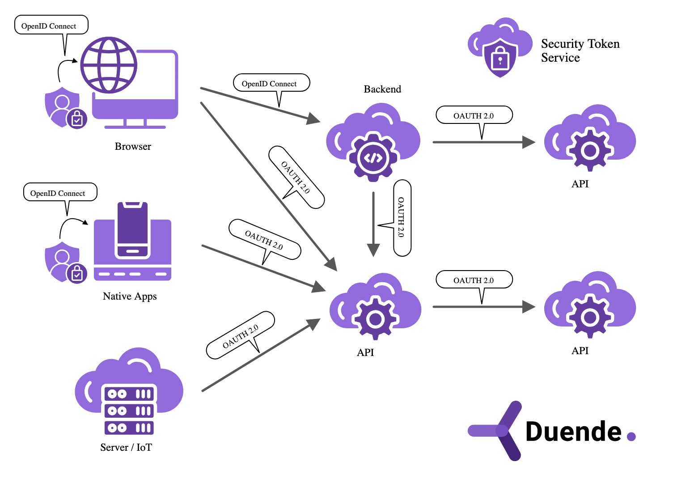

# Duende


## Authentication
Authentication is needed when an application needs to know the identity of the current user. Typically, these applications manage data on behalf of that user and need to make sure that this user can only access the data for which they are allowed.


The most common authentication protocols are SAML2p, WS-Federation and OpenID Connect – SAML2p being the most popular and the most widely deployed.

## API Access

Applications have two fundamental ways with which they communicate with APIs – using the application identity, or delegating the user’s identity. Sometimes both methods need to be combined.

OAuth 2.0 is a protocol that allows applications to request access tokens from a security token service and use them to communicate with APIs. This delegation reduces complexity in both the client applications and the APIs since authentication and authorization can be centralized.


There Are Two Main Platform-Specific Native App Types:

1. Mobile Native Apps

Built specifically for mobile OS platforms like iOS or Android.Use platform-native SDKs and languages:
- iOS: Swift or Objective-C + iOS SDK
- Android: Kotlin or Java + Android SDK
2. Desktop Native Apps

## Resources

Resources are something you want to protect with your IdentityServer - either identity data of your users, or APIs.

Every resource has a unique name - and clients use this name to specify to which resources they want to get access to.

Identity data Identity information (aka claims) about a user, e.g. name or email address.

APIs APIs resources represent functionality a client wants to invoke - typically modelled as Web APIs, but not necessarily.

resources represent protected assets (data or functionality) that clients can request access to. Clients ask for access to resources, and IdentityServer issues tokens scoped to those resources.

There are two major types:
1. Identity Resources (User Identity Data)
These represent user claims that clients want in ID tokens (from OpenID Connect flows).
2. API Resources (Functionality Protection)
These represent APIs or backend systems that clients want to access using access tokens (OAuth 2.0).

## Access Token
An access token allows access to an API resource. Clients request access tokens and forward them to the API. Access tokens contain information about the client and the user (if present). APIs use that information to authorize access to their data and functionality.

## IdentityProviderRestrictions
used to restrict which external identity providers a client is allowed to use during login.

## What does it do?

When you configure multiple external identity providers (like Google, Azure AD, Facebook, etc.), by default, a client can use any of them. The IdentityProviderRestrictions property allows you to whitelist specific providers for a given client.


```c#
new Client
{
    ClientId = "myclient",
    // ...
    IdentityProviderRestrictions = { "google", "azuread" }
}

```
```This tells IdentityServer that this client is only allowed to authenticate users via the listed providers ```

The identity provider name (`"google"`, `"azuread"`, etc.) must match the AuthenticationScheme used when registering the external provider in ASP.NET Core

```c#
services.AddAuthentication()
    .AddGoogle("google", options => {
        // config
    })
    .AddOpenIdConnect("azuread", options => {
        // config
    });


 services.AddAuthentication()
    .AddGoogle("google", options =>
    {
        options.ClientId = "your-google-client-id";
        options.ClientSecret = "your-google-client-secret";
    })
    .AddOpenIdConnect("azuread", options =>
    {
        options.Authority = "https://login.microsoftonline.com/your-tenant-id/v2.0";
        options.ClientId = "your-azure-client-id";
        options.ClientSecret = "your-azure-client-secret";
        options.ResponseType = "code";
    })
    .AddFacebook("facebook", options =>
    {
        options.AppId = "your-facebook-app-id";
        options.AppSecret = "your-facebook-app-secret";
    });
   

```

The `"google"`, `"azuread"`, and `"facebook"` are the authentication scheme names and must match what you use in IdentityProviderRestrictions.


### AddAuthentication()

This is the core setup for authentication in ASP.NET Core. It:

- Sets the default authentication scheme
- Sets the default challenge scheme (used when authentication is required but missing)
- Initializes the authentication system


```c#
services.AddAuthentication(options =>
{
    options.DefaultScheme = CookieAuthenticationDefaults.AuthenticationScheme;
    options.DefaultChallengeScheme = "oidc"; // or "google", etc.
});
```

Without calling `AddAuthentication()`, nothing works.

providers like `AddGoogle()`, `AddFacebook()`, etc are shortcuts (wrappers) for `OAuth2-based` providers with opinionated defaults.

- `AddGoogle()` is essentially preconfigured `AddOAuth()` with Google's endpoints
- `AddFacebook()` wraps `AddOAuth()` for Facebook


You must use `AddOpenIdConnect()` and configure Google manually as an OpenID Connect provider.

```c#
services.AddAuthentication()
    .AddOpenIdConnect("googleoidc", options =>
    {
        options.Authority = "https://accounts.google.com";
        options.ClientId = "...";
        options.ClientSecret = "...";
        options.ResponseType = "code";
        options.Scope.Add("openid");
        options.Scope.Add("profile");
        options.Scope.Add("email");
    });

``` 
An authentication scheme is simply a named way to authenticate a user. Each scheme:
- Has a unique name (a string like "Cookies", "google", "oidc")

- Corresponds to a handler that knows how to authenticate using a particular method (e.g., cookies, JWTs, OAuth, OpenID Connect)

```sh
| Scheme Name | What It Does                                  |
| ----------- | --------------------------------------------- |
| `"Cookies"` | Looks for a cookie and validates it           |
| `"Bearer"`  | Looks for a JWT in the `Authorization` header |
| `"google"`  | Starts OAuth2 login with Google               |
| `"oidc"`    | Starts OpenID Connect login                   |
```

You register schemes using `AddAuthentication()`:


```c#
services.AddAuthentication(options =>
{
    options.DefaultScheme = "Cookies";        // For reading current user
    options.DefaultChallengeScheme = "oidc";  // For redirecting to login
});

//define the actual scheme(s)

.AddCookie("Cookies")
.AddOpenIdConnect("oidc", options => { ... })
.AddGoogle("google", options => { ... })

// The string names "Cookies", "oidc", and "google" are the authentication scheme names.


services.AddAuthentication(options =>
{
    options.DefaultScheme = "Cookies";               // Default for MVC-style pages
    options.DefaultChallengeScheme = "oidc";         // External login redirect (e.g., IdentityServer)
})
.AddCookie("Cookies")                                // For browser-based sessions
.AddJwtBearer("Bearer", options =>                   // For API clients
{
    options.Authority = "https://your-auth-server";
    options.Audience = "api1";
})
.AddOpenIdConnect("oidc", options =>                 // For interactive login
{
    options.Authority = "https://your-auth-server";
    options.ClientId = "mvc-client";
    options.ClientSecret = "secret";
    options.ResponseType = "code";
    options.SaveTokens = true;
});

```

 **DefaultScheme** 
 Shortcut: sets `DefaultAuthenticateScheme`, `DefaultChallengeScheme`, and `DefaultSignInScheme` all at once (unless explicitly overridden).   

 **DefaultAuthenticateScheme**  Used when **reading the user's identity** (`HttpContext.User`).                                                                                                              
 **DefaultChallengeScheme**     
 Used when authentication is **required but missing** (e.g., `[Authorize]` is hit and user is not authenticated). This is often a redirect to login (e.g., "oidc", "google"). 

 **DefaultForbidScheme**        
 Used when access is **forbidden** (user is authenticated but lacks permission). Controls how `403 Forbidden` responses are handled.                                          
 **DefaultSignInScheme**        
 Used when **signing in a user**, typically writes an auth cookie (e.g., "Cookies").                                                                                          
 **DefaultSignOutScheme**    
 Used when **signing out a user**, such as redirecting to an external logout URL.                                                                                        


```c#
services.AddAuthentication(options =>
{
    options.DefaultScheme = "Cookies";
    options.DefaultChallengeScheme = "oidc";
})
.AddCookie("Cookies")
.AddOpenIdConnect("oidc", options => { ... });
```

- `Cookies` used for storing authenticated user session
- `oidc` used for redirecting to external identity provider

```c#
services.AddAuthentication("Bearer")
    .AddJwtBearer("Bearer", options =>
    {
        options.Authority = "https://auth-server";
        options.Audience = "api1";
    });
```

- DefaultScheme is "Bearer"
- Used for validating the token in Authorization: Bearer <token> headers


 you can set `ForwardChallenge = "oidc"` in the `AddJwtBearer`(...) configuration. This is a common pattern in hybrid web apps where:

- JWT bearer authentication is used for protecting APIs, but
- If the user is not authenticated, you want to redirect them to an external login provider (like OpenID Connect), instead of just returning 401 Unauthorized


```c#
services.AddAuthentication("Default")
    .AddPolicyScheme("Default", "Default scheme", options =>
    {
        options.ForwardDefaultSelector = context =>
        {
            // If this is an API request, use JWT
            if (context.Request.Path.StartsWithSegments("/api"))
                return "Bearer";

            // Otherwise use cookies
            return "Cookies";
        };
    })
    .AddJwtBearer("Bearer", options => { /* ... */ })
    .AddCookie("Cookies", options => { /* ... */ });
```

Requests to `/api/*` will forward to the `"Bearer"` scheme, while everything else uses `"Cookies"`.

```c#
    services.AddAuthentication("SmartScheme")
    .AddPolicyScheme("SmartScheme", "Auto-select scheme", options =>
    {
        options.ForwardDefaultSelector = context =>
        {
            var hasBearer = context.Request.Headers["Authorization"].ToString().StartsWith("Bearer ");
            return hasBearer ? "Bearer" : "Cookies";
        };
    })
    .AddJwtBearer("Bearer", options => { /* token validation */ })
    .AddCookie("Cookies", options => { /* cookie auth */ });
```    

Then in your controllers, just use:
```c#
[Authorize] // Will use SmartScheme -> forwards to Bearer or Cookies
public IActionResult ProtectedData() { ... }

```
`[Authorize]`: This endpoint requires an authenticated user. If the user isn't authenticated, run the challenge process to initiate authentication.”


```sh
Authentication is the process of determining a user's identity. Authorization is the process of determining whether a user has access to a resource. In ASP.NET Core, authentication is handled by the authentication service, IAuthenticationService, which is used by authentication middleware. The authentication service uses registered authentication handlers to complete authentication-related actions. Examples of authentication-related actions include:

- Authenticating a user.
- Responding when an unauthenticated user tries to access a restricted resource.

The registered authentication handlers and their configuration options are called "schemes".

```

Authentication schemes are specified by registering authentication services in `Program.cs`:

- By calling a scheme-specific extension method after a call to AddAuthentication, such as `AddJwtBearer` or `AddCookie`. These extension methods use `AuthenticationBuilder.AddScheme` to register schemes with appropriate settings.
- Less commonly, by calling `AuthenticationBuilder.AddScheme` directly.

For example, the following code registers authentication services and handlers for cookie and JWT bearer authentication schemes:

```c#
builder.Services.AddAuthentication(JwtBearerDefaults.AuthenticationScheme)
    .AddJwtBearer(JwtBearerDefaults.AuthenticationScheme,
        options => builder.Configuration.Bind("JwtSettings", options))
    .AddCookie(CookieAuthenticationDefaults.AuthenticationScheme,
        options => builder.Configuration.Bind("CookieSettings", options));
```

The AddAuthentication parameter JwtBearerDefaults.AuthenticationScheme is the name of the scheme to use by default when a specific scheme isn't requested.

 when multiple authentication schemes are registered, you can request a specific scheme in several ways:


1. Per [Authorize] attribute

You can specify the scheme directly on a controller or action:
```c#
[Authorize(AuthenticationSchemes = "Cookies")]
public IActionResult MyPage() { ... }

[Authorize(AuthenticationSchemes = "Bearer")]
public IActionResult MyApi() { ... }
//This overrides the default scheme set in AddAuthentication(...)
```

2. Per policy

You can define a named authorization policy that uses a specific scheme:
```c#
builder.Services.AddAuthorization(options =>
{
    options.AddPolicy("ApiPolicy", policy =>
    {
        policy.AuthenticationSchemes.Add("Bearer");
        policy.RequireAuthenticatedUser();
    });

    options.AddPolicy("WebPolicy", policy =>
    {
        policy.AuthenticationSchemes.Add("Cookies");
        policy.RequireAuthenticatedUser();
    });
});
```

Then use:

```c#
[Authorize(Policy = "ApiPolicy")]
public IActionResult GetData() { ... }

```

3. Manually calling AuthenticateAsync
In custom middleware or logic, you can directly ask for a specific scheme:

```c#
var result = await context.AuthenticateAsync("Cookies");

if (result.Succeeded)
{
    var user = result.Principal;
    // do something
}
```

4. Using a policy scheme to auto-select

You can configure a policy scheme that dynamically forwards to a specific scheme based on the request:
```c#
builder.Services.AddAuthentication("Smart")
    .AddPolicyScheme("Smart", "Auto Select", options =>
    {
        options.ForwardDefaultSelector = context =>
        {
            return context.Request.Headers.ContainsKey("Authorization") ? "Bearer" : "Cookies";
        };
    });

```

Then just use:

```c#
[Authorize] // No scheme specified

```
If the user is not authenticated, ASP.NET Core will:
Look for the default challenge scheme (set in AddAuthentication(...))
and Call `ChallengeAsync()` on that scheme which may:
- Return 401 Unauthorized (e.g., JWT Bearer for APIs)
- Redirect to a login page (e.g., Cookies or OIDC)
- Forward the challenge to another scheme (e.g., ForwardChallenge = "oidc")


You configure multiple IdPs when your application serves different types of users, or different clients — and each needs access to different providers. You then control access using IdentityProviderRestrictions


Imagine a university system:

- Students log in via Google
- Staff log in via Azure AD
- External examiners via GitHub

You configure all three IdPs on the IdentityServer once and then control which IdP each client application or login flow uses.

```c#
new Client
{
    ClientId = "staff-portal",
    IdentityProviderRestrictions = { "aad" } // Azure AD only
},
new Client
{
    ClientId = "student-app",
    IdentityProviderRestrictions = { "google" } // Google only
}

```


`AddLocalApi() enables your IdentityServer to accept and validate JWT bearer tokens for its own protected APIs.`

`AddOAuth`	OAuth 2.0	External login using access tokens only (no id_token)


`AddAuthorization`

This is about what a user is allowed to do — after they're authenticated.

- Sets up policies, roles, claims-based access control
- It's part of the authorization system
- Used as services.AddAuthorization(...)

```c#
services.AddAuthorization(options =>
{
    options.AddPolicy("AdminOnly", policy =>
    {
        policy.RequireRole("Admin");
    });
});
[Authorize(Policy = "AdminOnly")]
public IActionResult AdminPanel() => View();

```

An authentication scheme is a name that corresponds to:

- An authentication handler.
- Options for configuring that specific instance of the handler.

Schemes are useful as a mechanism for referring to the authentication, challenge, and forbid behaviors of the associated handler. For example, an authorization policy can use scheme names to specify which authentication scheme (or schemes) should be used to authenticate the user. When configuring authentication, it's common to specify the default authentication scheme. The default scheme is used unless a resource requests a specific scheme. It's also possible to:

- Specify different default schemes to use for authenticate, challenge, and forbid actions.
- Combine multiple schemes into one using policy schemes.

**Authentication handler**

An authentication handler:

- Is a type that implements the behavior of a scheme.
- Is derived from `IAuthenticationHandler` or `AuthenticationHandler<TOptions>`.
- Has the primary responsibility to authenticate users.

Based on the authentication scheme's configuration and the incoming request context, authentication handlers:

1. Construct `AuthenticationTicket` objects representing the user's identity if authentication is successful.
2. Return 'no result' or 'failure' if authentication is unsuccessful.
3. Have methods for challenge and forbid actions for when users attempt to access resources:
  - They're unauthorized to access (forbid).
  - When they're unauthenticated (challenge).

**`RemoteAuthenticationHandler<TOptions> vs AuthenticationHandler<TOptions>`**

RemoteAuthenticationHandler<TOptions> is the class for authentication that requires a remote authentication step. When the remote authentication step is finished, the handler calls back to the CallbackPath set by the handler. The handler finishes the authentication step using the information passed to the HandleRemoteAuthenticateAsync callback path. OAuth 2.0 and OIDC both use this pattern. JWT and cookies don't since they can directly use the bearer header and cookie to authenticate. The remotely hosted provider in this case:

- Is the authentication provider.
- Examples include Facebook, Twitter, Google, Microsoft, and any other OIDC provider that handles authenticating users using the handlers mechanism.


Authenticate

An authentication scheme's authenticate action is responsible for constructing the user's identity based on request context. It returns an AuthenticateResult indicating whether authentication was successful and, if so, the user's identity in an authentication ticket. See AuthenticateAsync. Authenticate examples include:

- A cookie authentication scheme constructing the user's identity from cookies.
- A JWT bearer scheme deserializing and validating a JWT bearer token to construct the user's identity.


