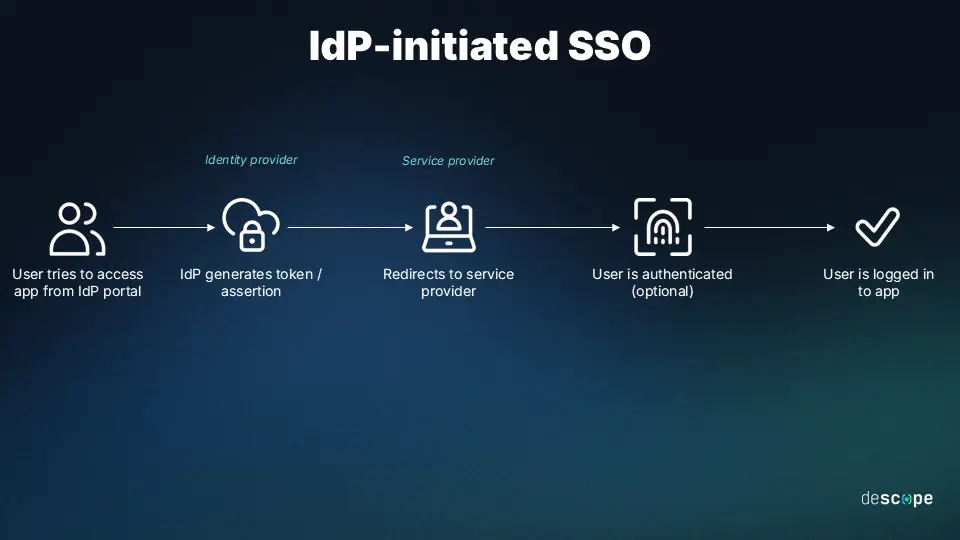

# SSO

Single sign-on is based on a digital trust relationship between service providers—applications, web sites, services—and an identity provider (IdP), or SSO solution

In general, SSO authentication works as follows:

- A user logs into one of the service providers, or into a central portal (such as an company intranet or college student portal) using SSO login credentials.
     
- When the user is successfully authenticated, the SSO solution generates a session authentication token containing specific information about the user's identity—a username, email address, etc. This token is stored with the user's web browser, or in the SSO system.
     
- When the user attempts to access another trusted service provider, the application checks with the SSO system to determine if user is already authenticated for the session. If so, the SSO solution validates the user by signing the authentication token with a digital certificate, and the user is granted access to the application. If not, the user is prompted to reenter login credentials.

## Federated identity management (FIM)

Federated identity management, or FIM, is a superset of SSO. While SSO is based on a digital trust relationship among applications within a single organization's domain, FIM extends that relationship to trusted third parties, vendors, and other service providers outside the organization. For example, FIM might enable a logged-in employee to access third-party web applications (e.g., Slack or WebEx) without an additional log-in, or with a simple username-only log-in.


```SSO relies primarily on the identity part provided by OpenID Connect (OIDC).```


## Single sign-on options

Choosing an SSO method depends on how the application is configured for authentication. Cloud applications can use federation-based options, such as OpenID Connect, and SAML. The application can also use password-based SSO, linked-based SSO, or SSO can be disabled.

In computing, a federation refers to the collaboration of multiple independent organizations or systems working together to achieve a common goal. 

[federation-computing](https://www.baeldung.com/cs/federation-computing)

`A federation in computing is a group of organizations or systems that maintain their autonomy but agree to share data, resources, or services to achieve a shared objective`. Federations can be established between different organizations, software applications, or even networks to create a unified, collaborative environment. The participants in a federation typically agree on a set of standards, protocols, and policies to facilitate cooperation and interoperability.

1. ## Federated Identity Management

Federated identity management enables users to access multiple independent systems using a single set of credentials. This approach simplifies the authentication process, reduces the number of passwords users need to remember and enhances security. Federated identity management can be implemented using protocols such as Security Assertion Markup Language (SAML), OpenID Connect, and OAuth.

## Use Cases

Federations have numerous applications in computing. 


SSO is only a part of a federated identity management system

[federated-identity](https://www.baeldung.com/cs/sso-guide#1-federated-identity)
A Single Sign-On mechanism (SSO) allows users to log in once to an application and get access to all related systems without the need to separately log in to them.

```sh
As we mentioned, thanks to SSO, a user can log in once to service and is automatically logged in to all related applications. As an example, let’s consider a Google account. After logging in to one of Google’s services, e.g., Gmail, the user is granted access to all other independent applications like Youtube, Google Play, or Google Drive. Further, the same credentials are used all over those related systems.
```


concerns that a federated identity must handle:
- Authentication
- Authorization
- User management

Authentication is a process of verifying a user’s identity. In simple words. it ensures that a user is really the person that he or she claims to be. There are a lot of popular authentication methods, like password, software or hardware token, personal identification number, fingerprint, etc.

The authorization process verifies if a user has permission to access a specific resource. For instance, an online shop administrator will be able to access resources that a buyer shouldn’t, e.g., updating the product’s price. Authorization should always happen after the authentication.

User management is the supervision of user accounts. So, generally speaking, creating, storing, and modifying them.

Single Sign-On is related only to an authentication process. Thus, it’s not a federated identity on its own, just a part of it. Its mission is to verify the user’s identity and share that information across the related applications.


The key to SSO is not sharing cookies between domains, but sharing trust in a central identity provider — the SSO server.


The session cookies are different — each domain (domain1, domain2, and SSO) has its own cookie, scoped to its domain.

## Architectures

There are multiple architectures that can be used to implement SSO.

The common use case is handled by `WEB SSO`. `WEB SSO is intended only for services that can be accessed using a web browser`. It allows users to access a group of web servers with a single login. There are two main approaches to implement WEB SSO:

- using a web-based reverse proxy controlling authentication process
- using an agent installed on each of the specific servers

This architecture usually uses cookies for tracking the state of authentication of the user. The SSO process described in the previous section applies to WEB SSO architecture.

`The federated SSO architecture provides authentication data (usually token) trusted across separate organizations`. That architecture uses popular protocols like WS-Federation, OAuth, or SAML to pass tokens. SSO architecture is especially useful in situations when multiple organizations are cooperating.

## When is Federated SSO especially useful?

When multiple organizations cooperate but don’t want to manage shared user accounts.

Examples:

- A university allowing students to log in to a third-party learning platform with their campus credentials.
- A government portal letting users authenticate with their national ID system.

- A B2B SaaS product that supports login via each customer’s internal identity system (e.g., Azure AD, Okta).


`Keycloak, which is by default a single sign-on solution for web apps and RESTful web services, we do not need to add any further configuration for SSO.`


Single sign-on options

Choosing an SSO method depends on how the application is configured for authentication. Cloud applications can use federation-based options, such as OpenID Connect, and SAML. The application can also use password-based SSO, linked-based SSO, or SSO can be disabled.

- `Federation` - When you set up SSO to work between multiple identity providers, it's called federation. An SSO implementation based on federation protocols improves security, reliability, end-user experiences, and implementation.

With federated single sign-on, Microsoft Entra authenticates the user to the application by using their Microsoft Entra account. This method is supported for SAML 2.0, WS-Federation, or OpenID Connect applications. Federated SSO is the richest mode of SSO. Use federated SSO with Microsoft Entra ID when an application supports it, instead of password-based SSO and Active Directory Federation Services (AD FS).

There are some scenarios where the SSO option isn't present for an enterprise application. If the application was registered using App registrations in the portal, then the single sign-on capability is configured to use OpenID Connect. In this case, the single sign-on option doesn't appear in the navigation under enterprise applications. OpenID Connect is an authentication protocol built on top of OAuth 2.0, which is an authorization protocol. OpenID Connect uses OAuth 2.0 to handle the authorization part of the process. When a user tries to log in, OpenID Connect verifies their identity based on the authentication performed by an authorization server. Once the user is authenticated, OAuth 2.0 is used to grant the application access to the user's resources without exposing their credentials.

[what-is-single-sign-on](https://learn.microsoft.com/en-us/entra/identity/enterprise-apps/what-is-single-sign-on)

[single-sign-on-overview](https://www.loginradius.com/docs/single-sign-on/overview/)


Single Sign On

Single Sign-On (SSO) refers to the authentication process that allows your customers to access multiple applications with a single set of login credentials and an active login session.

In the SSO ecosystem:

- Service Provider (SP): The user visits this application for service. In the SSO ecosystem, the SP is considered a Slave.
- Identity Provider (IdP): The service provider receives the user authentication status from the IDP, which is considered a master in the SSO ecosystem.


SSO streamlines authentication, allowing users to log in once and securely access multiple applications across different ecosystems. This reduces password fatigue, improves user experience, and enhances security.

- `Seamless User Access`: SSO enables users to move between different applications without repeated logins, ensuring a smooth and integrated experience.
- `Improved Productivity`: By eliminating the need for multiple credentials, SSO enhances efficiency for both individual users and organizations, reducing time lost to login issues and password resets.
- `Secure Third-Party and Partner Integrations`: Federated SSO facilitates secure authentication across external platforms, ensuring seamless business-to-business (B2B) and business-to-consumer (B2C) interactions without compromising security.
- `Unified Identity Management`: Centralized authentication allows organizations to enforce security policies across all applications, simplifying identity and access management.
- `Cross-Device and Cross-Platform Continuity`: Users can start a session on one device and continue it on another without reauthentication, providing a consistent and convenient experience across web, mobile, and desktop applications. For example, an employee logs in once to access HR portals, resource management tools, and project tracking systems like Jira.
- `Collaboration with External Partners`: Federated SSO enables businesses to integrate securely with partner systems without redundant authentication. For example, It Allows employees to access partner-provided SaaS tools like Salesforce or Asana using their enterprise credentials.
- `Unified Authentication` Simplifies access for developers working across multiple internal and external platforms. For example, a developer authenticates once to access all company SaaS applications, ensuring alignment with organizational IAM policies.

## SSO Workflow

The following steps illustrate the SSO workflow when implemented with the LoginRadius Identity Platform:

- When users visit site A (Service Provider), they access the site and click the login link, redirecting them to the Identity Provider (IDP).
- Authentication at the IDP: At the IDP, the user enters their credentials and is authenticated. A session is established, and the user is logged into Site A.
- Whenever the same user visits Site B (Service Provider) and clicks the login link, they are redirected to the IDP.
- Since the user’s session is still active, the IDP recognizes it and logs the user into Site B without requiring re-authentication.

## Types of SSO

- `Web SSO` simplifies browser-based session management by utilizing browser storage mechanisms like cookies, sessionStorage, or localStorage. LoginRadius IDX manages authentication through a centralized domain, which shares the session securely with authorized web applications. This ensures a seamless user experience across the web ecosystem. For more details on Web SSO, refer to our documentation here.

- `Mobile SSO` leverages shared storage, such as shared preferences on Android or keychain storage on iOS, to store the LoginRadius access token. This enables linked mobile apps to access an active session, ensuring continuity as users move between mobile apps in the same ecosystem. When a Single Sign-on is required between two or more mobile apps, LoginRadius Identity Platform acts as an Identity Provider. For more details on Mobile SSO, refer to our documentation here.

- `Federated SSO` supports authentication across multiple applications where LoginRadius acts as an Identity Provider or a Service Provider. This is especially useful in integrating third-party applications using standard protocols like SAML, OAuth, OpenID Connect (OIDC), and JWT. Identity providers can be organizational partners who issue and hold digital identities/tokens/tickets. With LoginRadius Federated SSO, your business can leverage that identity and make authentication seamless for your customers.

- `QR Code/Cross-Device SSO` synchronizes sessions across multiple devices, such as smartphones, tablets, and desktops. For example, if a user logs in on their smartphone, they can seamlessly continue their session on their laptop without needing to log in again. This provides a consistent and uninterrupted experience. For more details on Cross-Device SSO, refer to our documentation here.

- `Custom Identity Providers (BYOI)` allow organizations to configure bespoke application login solutions. This is ideal for scenarios where the available range of social login providers does not meet specific customer needs, and Custom Identity providers are frequently implemented in such cases.

- `SSO Connectors` are designed for third-party applications not supporting standard SSO protocols. By leveraging mechanisms like Password Delegation, LoginRadius creates a unified SSO experience for these applications, effectively bridging compatibility gaps. For more details on SSO Connectors, refer to our documentation here.

## Business Use Cases of Each SSO Type

- `Web SSO`: Enables seamless authentication across web applications within a controlled environment. This approach is ideal for businesses that own their domain and codebase, as it requires JavaScript and API-level integration.
Note: Web SSO ensures users can navigate between multiple web services without requiring multiple logins. It guarantees seamless navigation across web applications in a controlled ecosystem. Example: A customer moving between an online store and its loyalty program.
- `Mobile SSO`: Ensures session continuity across multiple mobile applications by leveraging shared storage mechanisms such as Android shared preferences or iOS keychain storage.
Note: This benefits applications that require authentication consistency across companion mobile apps. This leverages shared storage mechanisms such as Android shared preferences or iOS keychain storage. Example: A user accessing their mobile banking app and companion wallet app.
- `Federated SSO`: Enables authentication across multiple applications, whether internal or external, by utilizing shared authentication protocols such as SAML, OAuth, or OIDC.
Note: This is particularly useful for businesses that manage authentication across multiple partners and SaaS providers. It simplifies identity management for users and organizations. For example, Employees can access Salesforce, Jira, and other SaaS tools with a single corporate login.
- `Cross-Device SSO`: Allows users to maintain a consistent authentication session across various devices, including desktops, smartphones, and tablets.
Note: This enhances the user experience by eliminating the need to log in repeatedly when switching devices. For example, a streaming service allows users to start watching content on one device and continue on another without logging in again.
- `Custom IDPs(BYOI)`: Supports businesses with unique identity management needs by enabling the integration of custom authentication solutions.
Note: This benefits organizations requiring specialized authentication beyond standard identity providers—for example, a healthcare organization is linking its internal patient identity system with a telehealth platform.
- `SSO Connectors`: These provide authentication solutions for legacy systems or applications not supporting modern SSO protocols, ensuring a unified login experience.
Note: This is essential for businesses integrating older software with contemporary authentication methods. For example, an enterprise unifies access between its legacy resource planning software and a newly deployed mobile application.

[loginradius-sso-web-sso](https://www.loginradius.com/docs/single-sign-on/loginradius-sso/web-sso/)

## Web SSO Visual Flow


The following displays the sequence diagram of the Web SSO process:


## Federated SSO

Federated Single Sign-On (SSO) enables seamless access to third-party applications through trust relationships and standardized protocols for managing and mapping user identities.

Common Use Cases

Federated SSO is widely adopted across industries for various scenarios. Here are some key use cases:

- `Enterprise Resource Management`:
Employees can use a single login to access internal tools like HR platforms, project management systems, and intranet portals.
- `Customer Portals`:
It simplifies customers' access to multiple services within a business ecosystem, such as financial tools, e-commerce accounts, or utility dashboards.
- `Third-Party Integrations`:
Enables seamless access to partner or vendor platforms (e.g., Salesforce, Freshdesk) without requiring separate credentials.
- `Educational Institutions`:
Students, faculty, and staff can access learning management systems, libraries, and administrative services with one set of credentials.
- `Healthcare Systems`:
Streamlines authentication for patients and providers across multiple healthcare apps, including scheduling, telehealth, and billing systems.
- `B2B Collaborations`:
Simplifies secure access for partners and contractors to shared resources and tools within a controlled environment.

## OpenID Connect
OpenID Connect 1.0 is a simple identity layer built on the OAuth 2.0 protocol. It allows clients to authenticate end-users by leveraging the Authorization Server's verification process. In addition, it provides access to essential profile details, such as the user's name and email. OpenID Connect simplifies user identity management in web and mobile applications by combining authentication and authorization, delivering secure and seamless user experiences across various platforms.

[openid-connect-overview/](https://www.loginradius.com/docs/single-sign-on/federated-sso/openid-connect/overview/)

## OAuth 2.0

OAuth 2.0 is an open-standard authorization protocol that enables secure, delegated access to server resources on behalf of resource owners. This framework eliminates the need for users to share credentials with third-party applications, making it a cornerstone for modern authentication systems.

With OAuth 2.0, resource owners can authorize third-party clients to access their server resources by issuing an access token, ensuring a secure and seamless experience.


VP can also be used as a Single Sign On (SSO) solution to protect all web applications in the same domain.


The origin consists of the scheme (protocol), host (domain), and optional port (if non-default):

1. Origin: https://example.co.uk

This is the base identifier for security policies like CORS, cookies, and same-origin policy.
It includes:

- https (scheme)
- example.co.uk (host)
- default port 443 (implied because it's HTTPS)

2. Site

The site refers to the registrable domain used for same-site cookie policies and origin isolation.

- Site: example.co.uk

In the public suffix list model (used by browsers):
- co.uk is a public suffix
- example.co.uk is the registrable domain

This means two different subdomains like a.example.co.uk and b.example.co.uk are considered the same site, even though they’re different origins.

The SameSite cookie attribute restricts when cookies are sent:

- SameSite=Strict: Only sent in first-party contexts (no cross-site requests)

- SameSite=Lax: Sent in top-level navigations (GET), not for POST or iframe

-  SameSite=None: Sent in all contexts, including cross-site — requires Secure


The authorization server knows it's the same user mainly by using a session cookie stored in the browser — specifically for the domain of the authorization server (e.g., auth.example.com)

- app1.example.com
- app2.example.com
Shared auth server: auth.example.com

1. User logs in to app1.example.com

- The app redirects the user to auth.example.com for login (via OAuth2/OpenID Connect).
- User logs in successfully.
- The authorization server sets a session cookie like:
`Set-Cookie: auth_session=abc123; Domain=auth.example.com; Path=/; Secure; HttpOnly; SameSite=None`

2. User visits app2.example.com
- app2 also redirects to auth.example.com to authenticate.

- Browser sends the previously set auth_session cookie automatically, because it’s for the same domain (auth.example.com).

3. Auth server skips login and redirects back to app2 with an ID token or access token for the same user


Janssen Server supports the `device_sso` scope as defined by the specification. Software vendor wanting to leverage native SSO feature should build the apps so during initial user authentication, the app would send `device_sso` scope in the authorization request.

The presence of the `device_sso` scope in the authorization request would enable AS to return device_secret in the token response from the token endpoint.


### Device Secret

`device_secret` is an opaque value returned to the application from the token endpoint as a response to a token exchange request. Janssen Server will return `device_secret` only if the code provided by the application in token exchange request has `device_sso` scope.

Janssen Server also checks if the client has the token exchange grant type enabled (urn:ietf:params:oauth:grant-type:token-exchange).

The `device_token` claim in the returned token response contains the device secret. Janssen Server stores the device secretes issued to a client in the corresponding session-id.


## User Claims

Claim is a piece of information asserted about an Entity. User claims refer to pieces of information about the authenticated user, such as their name, email address, date of birth, and more. These claims provide the RP with specific attributes or characteristics associated with the user. The claims are issued by the IDP after successful authentication and are included in the ID Token (which is a JSON Web Token (JWT) that contains user-related information) and are also available through the `/userinfo` endpoint. 

## Logout
Janssen Server supports various end-user logout mechanisms by implementing OpenID Connect specifications. OpenID Connect specifications for RP-Initiated Logout, Front-Channel Logout and Back-Channel Logout can be leveraged by applications(RPs) to implement end-user logout.

RP(Relying party)
OAuth 2.0 Clients using OpenID Connect are also referred to as Relying Parties (RPs)
```sh
User logout can be initiated either at RP (application) first or at the OpenID Provider (OP) first. Whichever party (RP or OP) gets the logout request first, and has to inform the other party about the event so that both the RP and OP sessions get properly terminated. RP-initiated logout is RP's method to let OP know about the event while Front-channel logout or back-channel logouts are the mechanisms used by OP to initiate logout and let RP know.
```

## Session Management

A session is a reference identifier on the Jans Auth Server that connects to a person's authentication state. During an authentication workflow, Auth Server writes a cookie with the `session_id` in the person's browser. OpenID Native SSO defines a way for mobile apps from the same vendor to use the iOS or Android protected secret storage to store the `session_id`. By correlating the session, the IDP can return an identity assertion (`id_token`) to a client without needing to re-authenticate the person. SSO ensues.

For example, let's say a person uses a browser to navigate to the website of Relying Party (RP1), which redirects to Jans Auth Server for authentication. Once the person is authenticated, the OP creates a `session_id` cookie, sets the state to authenticated, and places it in the cache. If the person mavigates their browser to the website of RP2, it redirects to the OP for authentication; since the `session_id` detected via the cookie is already authenticated, the OP authenticates the person automatically for RP2 (without an authentication prompt).


## Killing Sessions

The End Session endpoint (/end_session) is where the user can end their own session

identity provider
service provide


[Native SSO for Mobile Apps](https://st.fbk.eu/assets/areas/events/OSW2018/osw2018_paper_9.pdf)

`A third-party cookie is a type of cookie that is set by a domain other than the one the user is currently visiting.`
Example:
- You visit example.com.
- That page includes an ad from `ads.tracker.com`.
- `ads.tracker.com` sets a cookie in your browser.

That cookie is a third-party cookie, because it's set by `ads.tracker.com`, not `example.com`

A first-party cookie is set by the website you are visiting directly (e.g., `example.com` sets a cookie while you're browsing `example.com`).


###. Best Practice for Full SSO Support
```sh
Set-Cookie: auth_session=...; SameSite=None; Secure; HttpOnly
```

When the user logins with the identity provider, the identity provider redirects the user back to your app with `idtoken` and `access`
A token is returned. When the token is received by the client,` it will set a cookie in the browser containing the identity,claims of the user`


[what-is-and-how-does-single-sign-on-work](https://auth0.com/blog/what-is-and-how-does-single-sign-on-work/)


The concept of a centralized or linked electronic identity is known as federated identity. Federated identity systems handle several concerns:
- Authentication
- Authorization
- User attributes exchange
- User management

The `authentication` aspect deals with validating user credentials and establishing the identity of the user.

`Authorization` is related to access restrictions (e.g., is the user allowed to access X resource?).

The `attributes exchange` aspect deals with data sharing across different user management systems. For instance, fields such as "real name" may be present in multiple systems. A federated identity system prevents data duplication by linking the related attributes.

Lastly, `user management` is related to the administration (creation, deletion, update) of user accounts. A federated identity system usually provides the means for administrators (or users) to handle accounts across domains or subsystems.

```sh
SSO is strictly related to the authentication part of a federated identity system. Its only concern is establishing the identity of the user and then sharing that information with each subsystem that requires the data.
```


Single Sign-On (SSO) Authentication


for security reasons, browsers enforce a policy known as the same origin policy. This policy dictates that cookies (and other locally stored data) can only be accessed by its creator (i.e. the domain that originally requested the data to be stored). In other words, domain X cannot access cookies from domain Y or vice versa. This is what SSO solutions solve in one way or the other: sharing session information across different domains.


Different SSO protocols share session information in different ways, but the essential concept is the same: there is a central domain, through which authentication is performed, and then the session is shared with other domains in some way.


For instance, the central domain may generate a signed JSON Web Token (JWT), which may be encrypted using JSON Web Encryption (JWE). This token may then be passed to the client and used by the authentication domain as well as any other domains. The token can be passed to the original domain by a redirect and it contains all the information needed to identify the user for the domain requiring authentication. As the token is signed, it cannot be modified in any way by the client.


```sh
Whenever users go to a domain that requires authentication, they are redirected to the authentication domain. As users are already logged-in at that domain, they can be immediately redirected to the original domain with the necessary authentication token.
```


OpenID Connect

OpenID Connect (OIDC) is an authentication protocol commonly used in consumer-facing SSO implementations. The OIDC protocol handles authentication through JSON Web Tokens and a central identity provider.

With OIDC:

- A user requests access to an application.

- The application redirects the user to the identity provider for authentication.

- The identity provider verifies the user, and if successful, prompts the user to grant data access to the application.

- If access is granted, the identity provider generates an ID Token, which contains user identity information that the application can consume.

- The identity provider returns the user to the application.

## Identity-provider-initiated SSO

For `Identity-Provider-initiated SSO`, a third-party Identity Provider (IdP) is the SSO provider.

When a user logs in to an application:

- The application redirects the user to an identity provider.

- The third-party identity provider performs authentication and authorization.

- Upon successful authentication, the user is returned to the application.

## Service-provider-initiated SSO

For `Service-Provider-initiated SSO`, Auth0 is the SSO Service Provider (SP).

When a user logs in to an application:

- The application presents the user with one or more external identity providers.

- The user selects an identity provider to authenticate with and logs in.

- Upon successful authentication, the user is returned to the application.

- SP-initiated SSO in Auth0 is handled by connections.


Use IdP-initiated SSO when users start authentication from the Identity Provider (IdP) dashboard, enabling seamless access to multiple applications.

Use SP-initiated SSO when users access an application directly, and it redirects them to the IdP for authentication before granting access.

```sh
SP-initiated SSO occurs when a user attempts to access a protected application directly through the SP. Because the user’s federated identity is managed by the IDP, the SP sends a SAML authentication request to the IDP. After the IDP authenticates the user, it provides the SP with a SAML assertion for the user.
```

[sp-sso-vs-idp-sso](https://jumpcloud.com/blog/sp-sso-vs-idp-sso)

## What Is IdP-Initiated SSO?
In IdP-initiated SSO, users navigate to the company’s identity provider and click on the application they want to access. 

In the background, the identity provider sends a SAML authentication request to the service provider to ensure the end user has the appropriate access privileges. If the provider accepts the SAML response, the user can log into the application and start their session.


## What Is SP-Initiated SSO?

Service provider-initiated SSO flips this scenario — a service provider requests authentication from an identity provider to validate an authenticated user’s access to an application.

When a user wants to log into an application, the application redirects the request to the company’s identity provider. The identity provider confirms the user’s identity and access level and sends a SAML response and assertion to the service provider, allowing the user to log in.


## What’s the Difference Between IdP-Initiated SSO and SP-Initiated SSO?

The main difference between IdP-initiated SSO and SP-initiated SSO is where users start the login process. IdP-initiated login requests start in the identity provider, whereas SP-initiated login requests start in the application users want to access.

An IdP-initiated login looks something like this:

- A user logs into the identity provider.
- The user clicks on the application they want to access in the IP catalog.
- The identity provider packages the user’s identity, pertinent information, and what the user can access into an XML-based SAML assertion.
- The identity provider sends a secure reference to the SAML assertion to the service provider or through the user’s browser.
- The service provider reviews the assertion and accepts the assertion as valid.
- The user is logged into the application and can begin their work.

An SP-initiated login looks something like this:

- An unauthenticated user goes to the login page of the application they want to use.
- The service provider redirects the user to the identity provider.
- The identity provider creates a SAML assertion and sends it to the service provider.
- The service provider accepts the assertion.
    The user is logged into the application and can begin their work.


Federation vs. SSO: Differences and relationship

While often used interchangeably, SSO and federation are related but distinct concepts, serving different purposes,

SSO allows users to access multiple applications with one set of credentials, typically within a single organization. Federation extends this concept across multiple organizations, allowing users to access services in other domains with their existing credentials through 

[dangers-of-idp-initiated-sso](https://www.scottbrady.io/saml/dangers-of-idp-initiated-sso)

Social login and SSO are both different ways of authentication and can be used together or individually, depending on the business requirements.


Modern SSO leverages social login, where users can access applications using their existing credentials for services like Google, Facebook, or Twitter.


- Frontegg
- Okta
-  Auth0
- OneLogin
- PingIdentity
- Keycloak


[guide-to-openid-saml-oauth](https://www.loginradius.com/blog/engineering/guide-to-openid-saml-oauth)


### What's the point of federation?

I rememeber seeing a keynote in 2018 at KubeCon where person X demoed an integration between two services with one of them running on AWS and the other running on GCP. Normally that would mean producing a number of secrets and configuring them on either side. His demo was different because there was a level of trust between the two sides, fedration if you will.

The Oxford dictionary describes "federation" as:
 the action of forming states or organizations into a single group with centralized control.

Centralised control within a single group sounds useful and just like X showed us GCP and AWS working in harmony
```sh
GCP's Workload Identity Federation technology.
AWS has a similar technology with its IAM (Identity Access Management), IdP (Identity Provider) and Secure Token Service (STS).
```

Before federation:

- Create a Google Cloud service account and grant IAM permissions
- Export the long-lived JSON service account key
- Upload the JSON service account key to a GitHub secret

After:

- Create a Google Cloud service account and grant IAM permissions
- Create and configure a Workload Identity Provider for GitHub
- Exchange the GitHub Actions OIDC token for a short-lived Google Cloud access token


```sh
This GitHub Action exchanges a GitHub Actions OIDC token into a Google Cloud access token using Workload Identity Federation. This obviates the need to export a long-lived Google Cloud service account key and establishes a trust delegation relationship between a particular GitHub Actions workflow invocation and permissions on Google Cloud
```


`ACTIONS_ID_TOKEN_REQUEST_URL`
and `ACTIONS_ID_TOKEN_REQUEST_TOKEN`

```curl
    OIDC_TOKEN=$(curl -sLS "${ACTIONS_ID_TOKEN_REQUEST_URL}&audience=minty.exit.o6s.io" -H "User-Agent: actions/oidc-client" -H "Authorization: Bearer $ACTIONS_ID_TOKEN_REQUEST_TOKEN")
    ```

